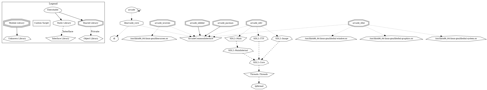

# arcAAAAAAAAAAAAAAAAade

[](https://github.com/Cavonstavant/arcAAAAAAAAAAAAAAAAade/actions/workflows/cmake.yml) [](https://github.com/Cavonstavant/arcAAAAAAAAAAAAAAAAade/actions/workflows/doc_build.yml) [](https://github.com/Cavonstavant/arcAAAAAAAAAAAAAAAAade/actions/workflows/mirroring.yml)

## Documentation

The documentation is currently hosted [here](https://cavonstavant.github.io/arcAAAAAAAAAAAAAAAAade/index.html).

> Local documentation can be generated using doxygen with running `doxygen` at the root of the repository. Use `xdg-open doc/build/html/index.html` to open it.

## Build

### Tools

- CMake >= 3.17.0
- g++20

### Building

On Linux:

```bash
    git clone https://github.com/Cavonstavant/arcAAAAAAAAAAAAAAAAade.git
    cd arcAAAAAAAAAAAAAAAAade/
    mkdir build && cd build
    cmake .. -G 'Unix Makefiles' -DCMAKE_BUILD_TYPE=Release
    cmake . --build
    cd ../
```

## Misc

Other group leader: henri.chauvet@epitech.eu

Epitech repository: https://github.com/EpitechPromo2025/B-OOP-400-NAN-4-1-arcade-constant.vigneron

Mirror repository: https://github.com/Cavonstavant/arcAAAAAAAAAAAAAAAAade

### Graphs

- Graphical representation of the dependencies of the project. > By having a graphical representation of the dependencies, we can ensure that the different project parts are actually independent.
  > 
